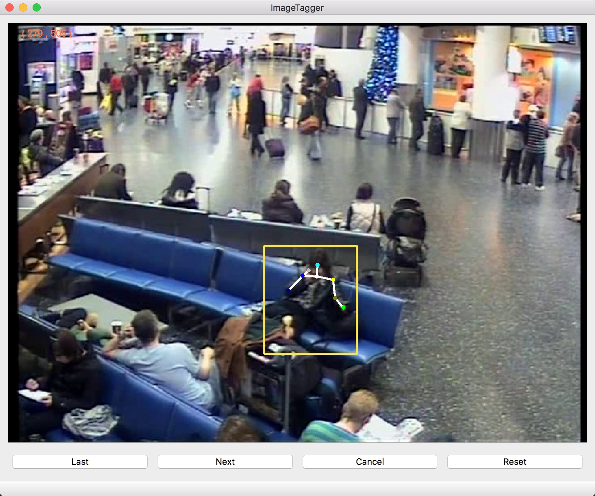

# SED Label System

A system in Qt  to label articulations of human pose for TRECVid SED task.

## Usage

* Drag: Move Points
* Right Click: delete Points (position will be save as: *-1 -1 PartName*)

* $APPROOT
  * MAC: ImageTager.app/contents/MacOS/
  * Winodws: Same directory with ImageTager.exe

* Index
  * $APPROOT/appenddata/test.txt
  * imagetagger.cpp - line 73
    * Change it to your index file path
  * Format
    * Imagename Class X_min Y_min X_max Y_max

* Images
  * $APPROOT/appenddata/images/
  * imagetagger.cpp - line 173
    * Change it to your images path

* Annotation Results
  * $APPROOT/appenddata/annos/
    * Create it before you run this application!
  * imagetagger.cpp - line 181
    * Change it to your result path
  * Format
    * x y partname

## Customize

* You can change *tagNumber* and *tagName* and pointNumber in *imagetagger.h* and *imagedisplay.h* to add or modify articulations to label.

## Example

)

## Author

> Chen Yang
>
> chenyang_1995@qq.com
>
> Github: Yan-Cy
>
> Feb 22, 2017